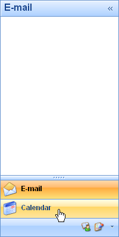
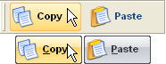
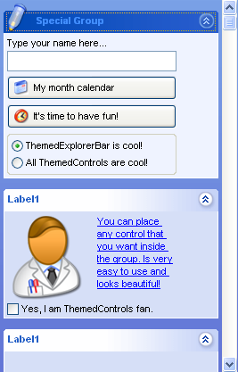
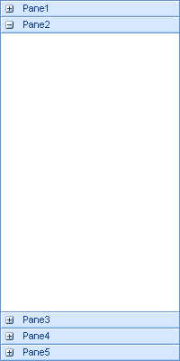
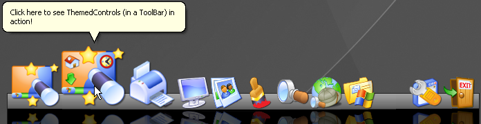
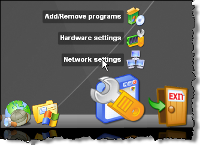
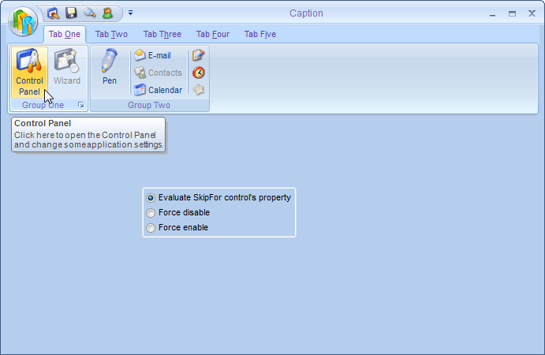

# ThemedControls
**A suite of controls created to improve the UI of your Visual FoxPro applications.**

Project Manager: Emerson Santon Reed ([emerson_reed@hotmail.com](mailto:emerson_reed@hotmail.com))

**OutlookNavBar**, formerly known as the Outlook2003Bar, is a very cool component included in this suite. It resembles the Outlook panel interface, making it perfect for grouping similar items in an application's UI. You’ll find working with the OutlookNavBar similar to working with a pageframe. It’s incredibly easy to use, and I think you'll agree that the results are amazing.

**Buttons**, a button class with two different styles (not finished yet).

**ExplorerBar**, a bar with group panels just like Windows XP.

**ToolBox**, a toolbar (similar to the new VFP ToolBox), with expand/collapse panels capability.

Another cool control in this suite is the **ZoomNavBar**. The current button is "zoomed" when the mouse passes over it and you can add a "menu" to be displayed when button is clicked.

**Ribbon**, a new menu style just like the one in Microsoft Office 2007 (not finished yet).

Here you can see a sample video showing some **ThemedControls** features.
[ThemedControls video](ThemedControls_ThemedControls.wmv)

Check the ThemedControlsHelp.htm file in VCX folder for more information on how to use ThemedControls (except for Ribbon that isn't documented yet).